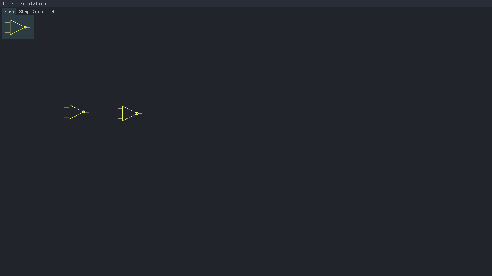

# 🤖 nandy
NAND-level circuit simulation

## Table of Contents
1. [Intro](#Intro)
2. [Build](#Build)
3. [TODOs](#TODOs)
4. [Images](#Images)

## Intro
I _really_ like [nand2tetris](https://www.nand2tetris.org/) and it's accompanying book [The Elements of Computing Systems, by Noam Nisan and Shimon Schocken](https://www.amazon.com/Elements-Computing-Systems-Building-Principles/dp/0262640686/ref=ed_oe_p).
One of my only criticisms was the lack of ability to zoom in and inspect the base NAND gates from any level of abstraction, those abstractions being enforced by successively high-level simulators.

My goal is to create a simulator that will allow you to complete the course, using only drag-and-drop NAND gates and simple supporting nodes, labels, pre-made circuits etc.

## Build
```
git clone https://github.com/zach2good/nandy.git
cd nandy
git submodule update --init --recursive
mkdir build
cd build
cmake ..
make .
```

## TODOs
- ~~First impl, not caring about performance~~
- ~~Second impl, use profiler to find pain points and improve performance at any cost~~
- Clean up performant impl
- Robust and easy to use GUI
- Reinstate saving/loading to JSON files
- Reinstate unit tests
- Zoom in/out

## Images

