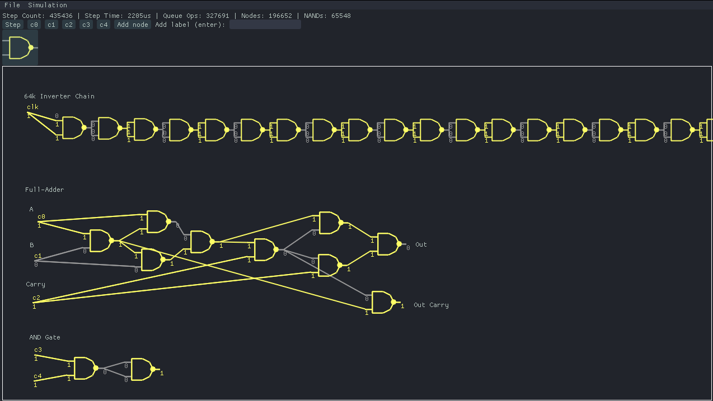

# 🤖 nandy
NAND-level circuit simulation

## Intro
I _really_ like [nand2tetris](https://www.nand2tetris.org/) and it's accompanying book; [The Elements of Computing Systems, by Noam Nisan and Shimon Schocken](https://www.amazon.com/Elements-Computing-Systems-Building-Principles/dp/0262640686/ref=ed_oe_p).

## Images

